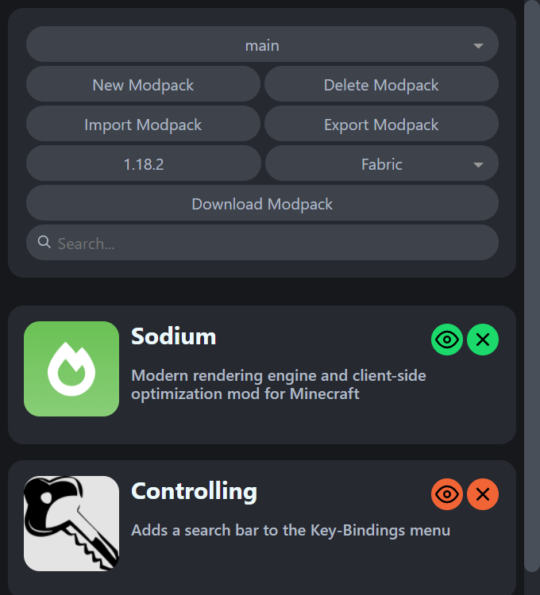

This project is an open source modpacker extension, which allows you to save mods from [Modrinth](https://modrinth.com/mods) and [CurseForge](https://www.curseforge.com/minecraft/mc-mods) to collections (modpacks) and download them at once.

Feel free to contribute to the project!

## Other features

-   Import & export of modpacks to share them with other people
-   Disabling of mods
-   Search bar to not be lost in the mod list
-   Drag & drop mods to reorder them
-   Theme synchronization with the Modrinth
-   Support for [Fabric](https://fabricmc.net/), [Forge](https://files.minecraftforge.net/net/minecraftforge/forge/) and [Quilt](https://quiltmc.org/)

## Planned features

-   Single mod download
-   Better add mod dialog
-   Groups

### Interface of the extension

Color of buttons matches the color of mod provider. Eg. Modrinth's buttons are green and CurseForge's are orange.

## Installation

### From extension store

-   Chrome requires me to buy developer license to publish the extension. I don't have it, so I can't publish it for now. [You can donate me to get it faster](#support)
-   [Edge](https://microsoftedge.microsoft.com/addons/detail/selene-modpacker/dfnmpodechfppakhgbdpjmcilmlfolpa)

### From GitHub

1. Open the extensions page in your browser.
    - [Chrome](chrome://extensions)
    - [Firefox](about:addons)
    - [Edge](edge://extensions)
    - [Opera](opera://extensions)
2. Enable developer mode.
3. Click the "Load unpacked" button.
4. Select the folder where you unpacked the extension (obviously, you have to download it first).
5. Also make sure you don't delete extension folder, because if you, it will be gone.
6. You're done!

## Usage

1. Click the extension icon in the toolbar.
2. Click the "New modpack" button and enter a name for the modpack.
3. Reload the Modrinth or CurseForge page and you'll see the buttons to add mods to your modpack.
4. Click the buttons to add mods to your modpack.
5. Select version and a modloader.
6. Click "Download" to download the modpack. Or "Export" to share the modpack with friends (If you have ones).

## Support

If you want to support me, you can donate me [here](https://www.paypal.com/donate/?hosted_button_id=DRPEBNY8MAYLE). First 5$ will be used to buy developer license for Chrome.
Or would be cool if you [support Ukraine](https://bank.gov.ua/en/news/all/natsionalniy-bank-vidkriv-spetsrahunok-dlya-zboru-koshtiv-na-potrebi-armiyi).
